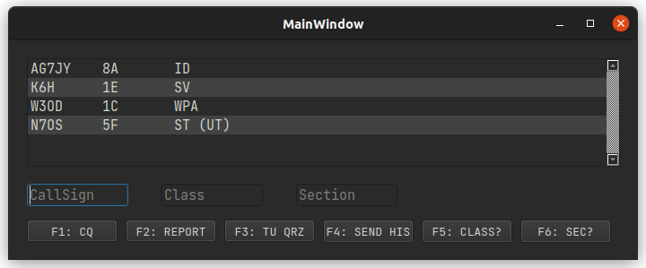

# Field Day Morse Trainer
Simulates working Morse (CW), during Field Day. At least, that's the plan.



## Why?
Well, because I still suck at CW. I'm much better at writing code than copying CW. And if you look at some of my code... You'll think WOW! You must really suck at CW. 

## It's very early days.
Really early. This aint no G4FON Contest Trainer. It's not even fully functional. But I had a day off work yesterday and this is what I did in-between shuttling kids back and forth from school.

### Update
It's actually not that bad now. After fixing a transposition in the check for error_level, the ham robots actually can figure out that you're not talking to them and stop being LIDS.

Right now it'll let you: 

*  Send CQ, something(s) will answer you with their call(s). 
*  You guess, replying full/partial callsigns.
*  It/They will repeat their call if your wrong, or let you know your right.
*  You send the exchange, they will reply with their exchange.
*  You tell them to repeat a call, class or section, they repeat the requested info.
*  When you press Enter or press the F3 confirm key, a Thank You "tu" is sent and the "Log" window will show if you were right. Anything wrong will display beside your input in parentheses. So if I logged "K6GTE 1F ORG", but the caller was sending "K6GTE 1C ORG", it would show as: `K6GTE 1F(1C) ORG`.
*  No Score is kept at the moment. You just ~~basque~~ bask in the glow of your participation trophy.

## How the sausage is made.
It's written in Python. I uses Qt5 for windowing/buttons. It uses the Linux program `morse` to generate the audio. There's no settings file yet. Right now settings are just a block of code.

```
SIDE_TONE = 650
BAND_WIDTH = 300
MAX_CALLERS = 3
MINIMUM_CALLER_SPEED = 10
MAXIMUM_CALLER_SPEED = 30
MY_CALLSIGN = "K6GTE"
MY_CLASS = "1B"
MY_SECTION = "ORG"
MY_SPEED = 30
```

When the program loads it will spawn from 1 to MAX_CALLERS threads. These threads are the simulated Field Day participants that you will be interacting with. Each one chooses a random sending speed and frequency. They get a randomly generated US Callsign and Class. The random Section is based on their call district.

I'm rather new to Threading. And well, it might show. I'm sure what I'm doing probably has a much better way of having it done. Each thread has what I would call a state machine, that defines it's behavior to your input. It's not going to win any awards. The threads use what I believe is called a Levenshtein distance, to figure out if your replying to them. A kind of 'Close enough, so he must have been sending my call, right?' 

So when you send your CQ, maybe several threads will respond with their calls. They then listen for your response. And if it's close enough they will send it again. So you kind of thin the herd. All the normal strategies should work. So if you get a pileup, you can just send a 6 or a K or something if you can't pick out character from the 'wall of sound'.

These threads spawn a copy of the `morse` program to generate the audio. Sometimes something goes wrong with one of them and it doesn't send anything and hangs. I don't know why, but hey, it's like real Field Day where the guy/gal will just give up and turn the dial. To prevent these zombie processes, the subprocess has a timeout of 15 seconds. And at the end of the contact, when you send the confirmation/tu/qrz, the threads are told to die and new ones are spawned.

All this may change. Again, early days.

## The minimum you need.

*  Python, something 3.8 or later would be nice.
*  The PyQt5 library, either pip install it, or apt install python3-pyqt5. Not sure what you Arch people do, maybe pray...
*  The Linux program `morse`.

